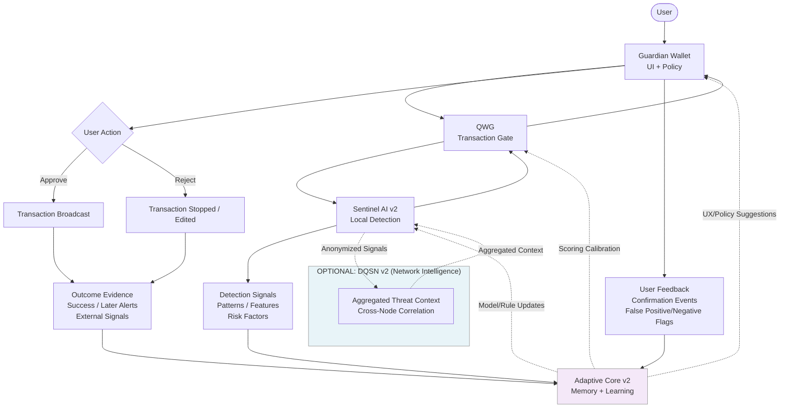

# Adaptive Core Learning Loop

This document explains how the Adaptive Core v2 improves protection over time
without taking control away from the user.

Key ideas:
- Learning is derived from observed outcomes and user decisions
- Updates improve detection, scoring, and UX
- Authorization always remains with the user and local policy

---

## Adaptive Core Learning Loop

Legend:
- Solid arrows = runtime events and outputs
- Dotted arrows = learning updates and knowledge propagation

---

## Safety Properties

- The Adaptive Core does not sign transactions.
- The Adaptive Core does not move funds.
- The Adaptive Core does not bypass user policy.
- Learning produces recommendations and updates only, not autonomous actions.

---

## Notes

This loop is designed to be testnet-friendly:
- instrumentable (logs, metrics, replay)
- reviewable (versioned rule/model updates)
- reversible (rollback to known-good profiles)
