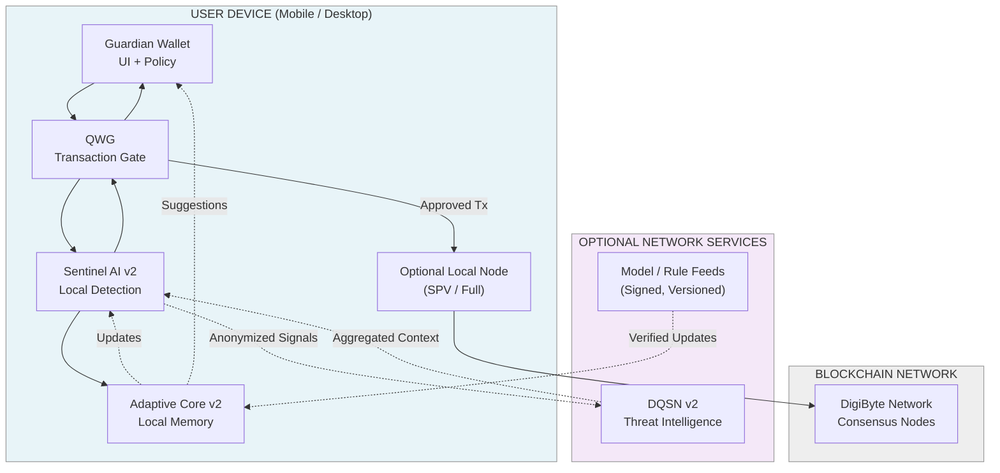

# Deployment Topology

This document describes how Adamantine components are deployed,
what runs locally on the user device, and what is optional network-assisted
infrastructure.

Key ideas:
- Core protection works fully offline
- Network components are optional and non-authoritative
- No single point of failure or mandatory server dependency

---

## Deployment Topology

Legend:
- Solid boxes = on-device components
- Dashed boxes = optional network components
- Solid arrows = runtime interaction
- Dotted arrows = optional intelligence exchange

---

## Offline Behavior

When the device is offline:
- Transactions can still be prepared and reviewed
- Local detection and policy enforcement remain active
- Network intelligence is skipped without failure

---

## Trust Boundaries

- Private keys never leave the user device
- Network intelligence cannot authorize transactions
- Updates are optional and cryptographically verified

---

## Notes

This topology is designed to scale from mobile wallets
to advanced users running local nodes,
without changing the trust model.
