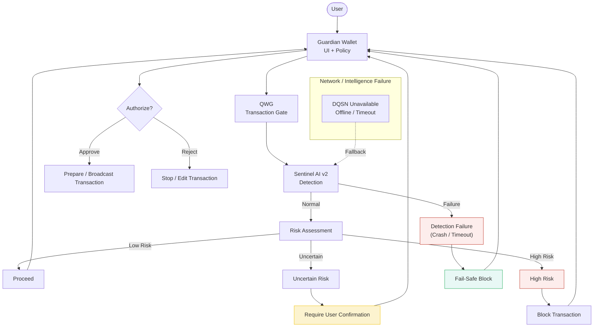

# Failure Modes and Safeguards

This document describes how the Adamantine Wallet behaves under failure,
uncertainty, or degraded conditions, and what safeguards are applied to
protect the user.

Key ideas:
- Fail-safe defaults
- Graceful degradation
- User remains the final authority
- No single point of failure

---

## Failure Modes and Safeguards

Legend:
- Solid arrows = runtime behavior
- Dashed arrows = fallback paths
- Red boxes = failure conditions
- Green boxes = safeguards

---

## Safeguard Principles

- When in doubt, slow down.
- When uncertain, ask the user.
- When failing, block safely.
- When offline, continue locally.

---

## Notes

These safeguards ensure that even under degraded conditions,
the wallet never acts autonomously or unsafely.
