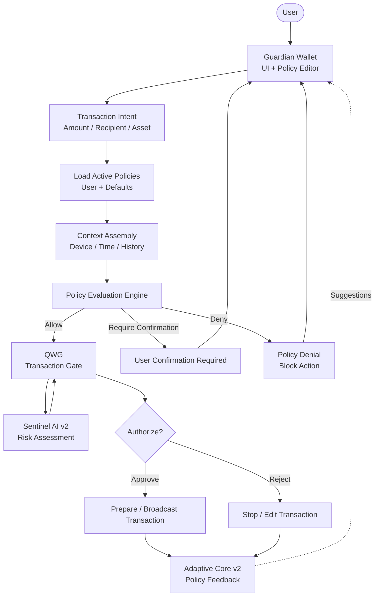

# Policy Engine Flow

This document explains how user-defined policies are evaluated during
transaction preparation and authorization in the Adamantine Wallet.

Key ideas:
- Policies are evaluated locally
- Users remain in control of final authorization
- Policies constrain behavior, they do not automate spending

---

## Policy Engine Flow

Legend:
- Solid arrows = runtime evaluation path
- Decision nodes = explicit user or policy gates

---

## Policy Types

- Spend limits (amount, frequency)
- Destination allowlists / blocklists
- Time-based restrictions
- Asset-specific rules
- Confirmation thresholds

---

## Safety Properties

- Policies never sign transactions
- Policies cannot bypass user confirmation
- All enforcement happens on-device

---

## Notes

The policy engine exists to reduce user error and risk exposure,
not to automate financial decisions.
