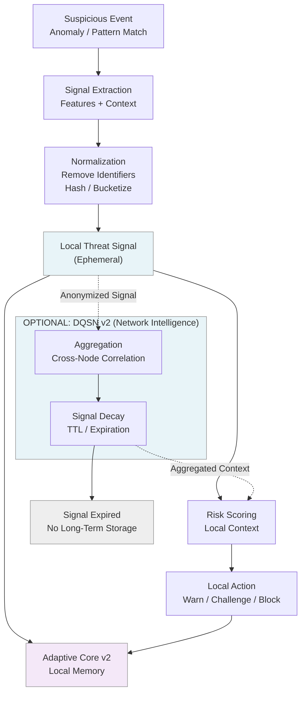

# Threat Signal Lifecycle

This document describes how threat signals are created, processed, shared,
and expired within the Adamantine protection architecture.

Key ideas:
- Signals are derived from behavior, not identities
- Signals are anonymized before any sharing
- Signals have a limited lifetime and are not permanently stored
- Users are never tracked or deanonymized

---

## Threat Signal Lifecycle

Legend:
- Solid arrows = local processing
- Dotted arrows = optional network sharing
- Dashed boxes = transient data (time-limited)

---

## Privacy Properties

- No wallet addresses are shared.
- No private keys are accessed.
- No persistent user identifiers are transmitted.
- Signals are aggregated and decayed over time.

---

## Notes

Threat signals exist to improve protection, not to monitor users.
All sharing is optional and non-blocking.
