# Transaction Defense Flow

This document describes the **runtime transaction protection path** used by the
Adamantine Wallet and its Quantum Shield architecture.

It focuses on:
- Real-time transaction analysis
- Layered defense responsibilities
- User-controlled authorization
- Asynchronous learning and intelligence propagation

---

## Overview

Adamantine does not rely on a single security mechanism.
Instead, it applies **layered, composable defenses** that evaluate each
transaction before it is broadcast to the network.

Protection is implemented at the wallet layer, where user intent,
context, and risk can be accurately assessed without altering
blockchain consensus rules.

---

## Transaction Defense Flow (Runtime Path)

> **Solid arrows** represent real-time transaction flow  
> **Dotted arrows** represent asynchronous learning and intelligence propagation

```mermaid
graph TB
    Start([User Initiates Transaction])

    %% =========================
    %% RUNTIME DEFENSE PATH
    %% =========================
    Start --> Sentinel

    subgraph L1["LAYER 1 — Sentinel AI v2 (Detection)"]
        Sentinel["Pattern Detection<br/>Anomaly Analysis<br/>Threat Scoring"]
    end

    subgraph L2["LAYER 2 — DQSN v2 (Network Intelligence)"]
        DQSN["Global Threat Signals<br/>Cross-Node Correlation<br/>Risk Aggregation"]
    end

    subgraph L3["LAYER 3 — ADN v2 (Defense Orchestration)"]
        ADN["Defense Coordination<br/>Playbook Selection<br/>Response Strategy"]
    end

    subgraph L4["LAYER 4 — QWG (Transaction Gate)"]
        QWG["Transaction Safety Checks<br/>PQC Verification<br/>Reputation & Context"]
    end

    subgraph L5["LAYER 5 — Guardian Wallet (User Control)"]
        Guardian["Risk Presentation<br/>User Policy Enforcement<br/>Final Authorization"]
    end

    Sentinel -->|Threat Signals| DQSN
    DQSN -->|Network Context| ADN
    ADN -->|Defense Plan| QWG
    QWG -->|Risk Assessment| Guardian

    Guardian --> Decision{Risk Level}

    Decision -->|LOW| Approve["✅ Approved<br/>Transaction Proceeds"]
    Decision -->|MEDIUM| Challenge["⚠️ Challenge<br/>User Confirmation"]
    Decision -->|HIGH| Block["🚫 Blocked<br/>Transaction Halted"]

    Approve --> AdaptiveCore
    Challenge --> AdaptiveCore
    Block --> AdaptiveCore

    %% =========================
    %% INTELLIGENCE & LEARNING PLANE
    %% =========================
    subgraph Adaptive["ADAPTIVE CORE v2 (Learning Plane)"]
        AdaptiveCore["Continuous Learning<br/>Pattern Memory<br/>Model & Rule Updates"]
    end

    AdaptiveCore -.Feedback Loop.-> Sentinel
    AdaptiveCore -.Threat Intelligence.-> DQSN

    %% =========================
    %% STYLING
    %% =========================
    style Start fill:#4A90E2,stroke:#333,stroke-width:1px
    style Approve fill:#2ECC71,stroke:#333
    style Challenge fill:#F39C12,stroke:#333
    style Block fill:#E74C3C,stroke:#333
    style AdaptiveCore fill:#9B59B6,stroke:#333

    style L1 fill:#E8F4F8,stroke:#999
    style L2 fill:#E8F4F8,stroke:#999
    style L3 fill:#E8F4F8,stroke:#999
    style L4 fill:#E8F4F8,stroke:#999
    style L5 fill:#E8F4F8,stroke:#999
    style Adaptive fill:#F4E8F8,stroke:#999
```

---

## Design Principles

- **User sovereignty first** — the user remains the final authority
- **Fail-safe defaults** — high-risk actions are blocked
- **Defense in depth** — no single layer is trusted
- **Learning without control** — intelligence improves protection without
  removing agency

---

## Notes

This document describes wallet-layer behavior only.  
It does not modify blockchain consensus, cryptography,
or protocol rules.

The architecture is designed to be composable and testable
on public testnets before any production deployment.
