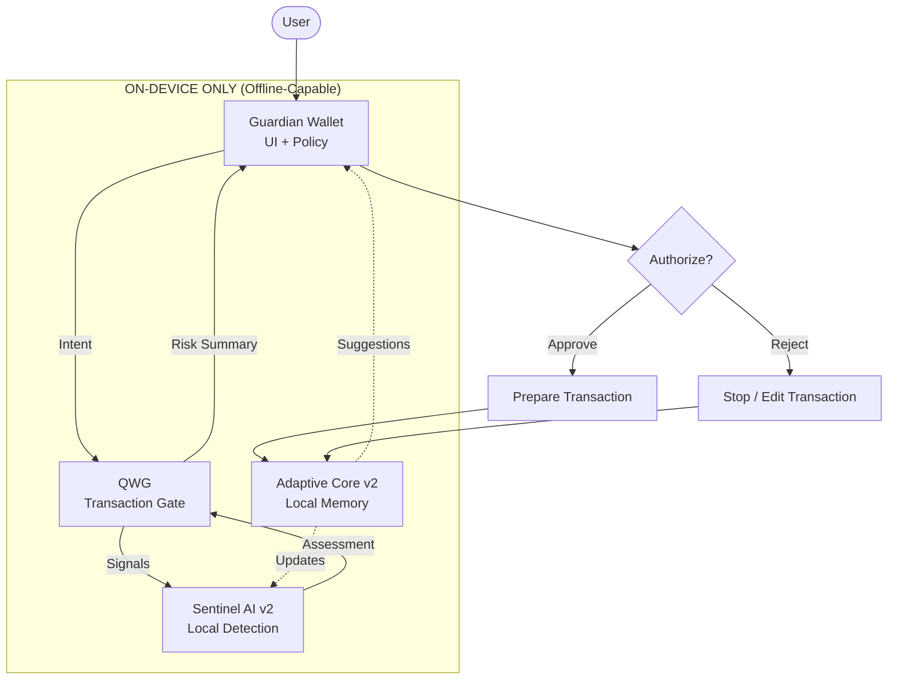

# Wallet-Only Minimal Flow

This document shows the **minimal protection path** when Adamantine is used
without any optional network intelligence or external services.

Key ideas:
- Fully local operation
- No dependency on DQSN or network connectivity
- User remains the final authority at all times

---

## Wallet-Only Minimal Flow

Legend:
- Solid arrows = local runtime path
- No dotted arrows (no network interaction)

---

## Properties

- Works fully offline
- No data leaves the device
- No network intelligence required
- No loss of protection features

---

## Notes

This flow represents the safest baseline configuration and
is suitable for cold environments, air-gapped review,
and high-sovereignty users.
