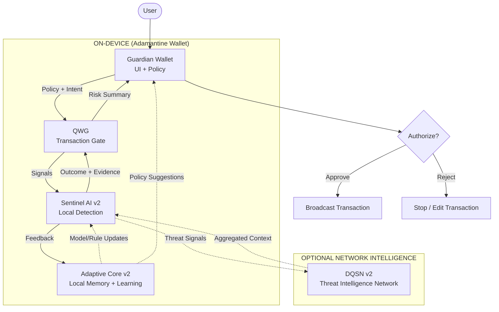

# Wallet Protection Stack

This document provides a high-level view of the Adamantine Wallet protection stack,
showing what runs locally inside the wallet and what is optional network-assisted intelligence.

Key ideas:
- Enforcement happens locally (user remains in control)
- Network intelligence is optional (DQSN can be enabled or disabled)
- Learning improves protection without removing agency

---

## Wallet Protection Stack

Legend:
- Solid arrows = runtime path (what happens when a user prepares/sends a transaction)
- Dotted arrows = optional intelligence sharing (non-blocking)

---

## Notes

- The wallet remains the enforcement point: decisions are made locally.
- DQSN is optional: protection continues to work without network access.
- The Adaptive Core improves detection and user experience over time without taking control.
